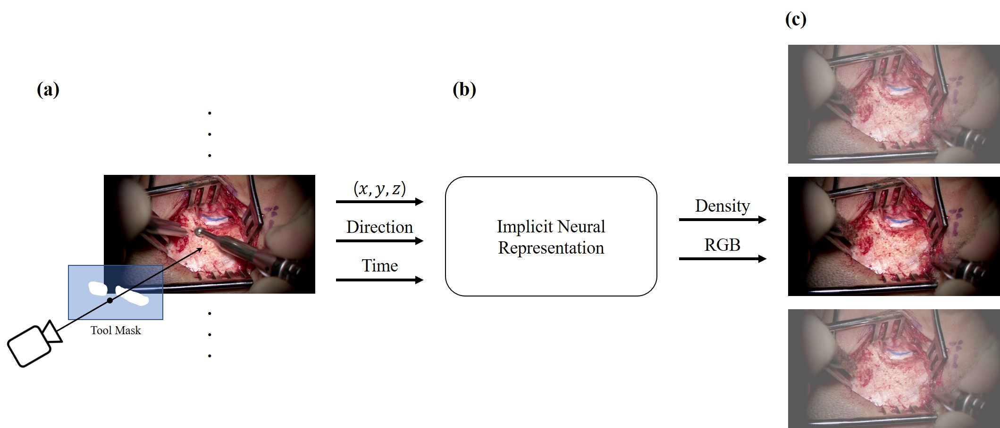

# TMInpainting
TMInpainting is a project for Tympanomastoidectomy Surgical Tool Video Inpainting using deep learning.

## Overview



## For Training with Inference
```python
python main.py experiment/dataset=ent_video.yaml \
    experiment/training=ent_tensorf \
    experiment.training.val_every=10 \
    experiment.training.test_every=25 \
    experiment.training.ckpt_every=5 \
    experiment.training.render_every=20 \
    experiment.training.num_epochs=30 \
    experiment/model=neural_3d_z_plane \
    experiment.params.print_loss=True \
    +experiment/regularizers/tensorf=tv_4000 \
    experiment.dataset.val_all=True \
    experiment.dataset.val_set=[]
```
